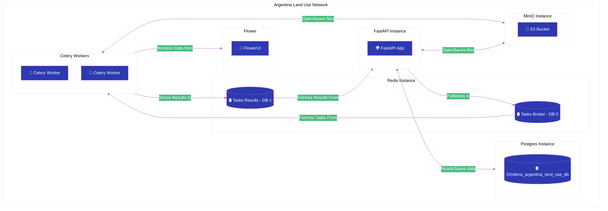

<h1 style="color: #af55c4; font-size: 24px; font-weight: bold; text-align: center; padding: 10px; border: 2px solid #af55c4;">Argentina Land Use - Services</h1>

## Overview



## General File Structure

<details>
  <summary>Click here to expand the application's file structure graphic</summary>

```
virtual-machine
+---celery
|   +---app
|   |   __init__.py
|   |   celery_app_with_priorities.py
|   |   celery_app.py
|   |   tasks.py
|   |   requirements.txt
|   |
|   .env
|   Dockerfile
|   Dockerfile.txt
|   README.md
|
+---docker-setup
|   README.md
|
+---fast-api
|   +---app
|   |   +---alembic
|   |   |   +---versions
|   |   |   |
|   |   |   alembic.ini
|   |   |   env.py
|   |   |   script.py.mako
|   |   |   
|   |   +---api
|   |   |   +---v1
|   |   |   |   +---endpoints
|   |   |   |   |   __init__.py
|   |   |   |   |   auth.py
|   |   |   |   |   places.py
|   |   |   |   |   processing.py
|   |   |   |   |
|   |   |   |   __init__.py
|   |   |   |   api.py
|   |   |   __init__.py
|   |   |   deps.py
|   |   |   
|   |   +---celery
|   |   |   celery_config.py
|   |   |
|   |   +---core
|   |   |   config.py
|   |   |   security.py
|   |   |
|   |   +---db
|   |   |   session.py
|   |   |
|   |   +---models
|   |   |   __init__.py
|   |   |   models.py
|   |   |
|   |   +---schemas
|   |   |   schemas.py
|   |   |   
|   |   +---services
|   |   |   __init__.py
|   |   |   place_service.py
|   |   |   processing_service.py
|   |   |   user_service.py
|   |   |   
|   |   main.py
|   |   requirements.txt
|   |
|   .env
|   Dockerfile
|   entrypoint.sh
|   README.md
|
+---postgres
|   +---backup
|   |
|   docker-entrypoint.sh
|   
+---redis
|   .env
|   redis.conf
|   README.md
|
+---vm-setup
|   +---src
|   |   appliance-import-1.jpg
|   |   appliance-import-2.jpg
|   |   appliance-import-3.jpg
|   |   appliance-import-4.jpg
|   |   appliance-import-5.jpg
|   |   appliance-import-6.jpg
|   |   appliance-import-7.jpg
|   |   appliance-import-8.jpg
|   |   appliance-import-9.jpg
|   |   appliance-import-10.jpg
|   |   new-virtual-machine-1.jpg
|   |   new-virtual-machine-2.jpg
|   |   new-virtual-machine-3-7.jpg
|   |   new-virtual-machine-8-9.jpg
|   |   new-virtual-machine-10-12.jpg
|   |   new-virtual-machine-13-15.jpg
|   |   new-virtual-machine-16.jpg
|   |   new-virtual-machine-17.jpg
|   |   new-virtual-machine-18.jpg
|   |   new-virtual-machine-19.jpg
|   |   new-virtual-machine-20.jpg
|   |   new-virtual-machine-21.jpg
|   |   new-virtual-machine-22.jpg
|   |   new-virtual-machine-23a.jpg
|   |   new-virtual-machine-23b.jpg
|   |
|   README.md
|
|---.env
|---.gitignore
|---docker-compose.yaml
|---README.md
```

</details>

## Setup

### Environment Details
- **Demo**: The demo runs on a Virtual Machine using **Ubuntu 24.04**. If you want to run the machine in your own environment, you can check the Virtual Machine Tutorial [here](vm-setup/README.md)

- **Docker 27.5.1** (build 9f9e405) and **Docker Compose 2.32.4** were installed on the Virtual Machine. Please note, earlier Docker versions are not available on Ubuntu 24.04. For installation details, refer to [this guide](docker/README.md).
  
- **Resource Allocation**: The machine has been provisioned with the following resources:1-

<table align="center">
  <thead>
    <tr>
      <th>Operating System</th>
      <th>Base Memory</th>
      <th>Processors</th>
      <th>Storage</th>
     </tr>
  </thead>
  <tbody>
    <tr>
      <td>Ubuntu 24.04 64-bits</td>
      <td>1024Mb</td>
      <td>2</td>
      <td>25Gb</td>
    </tr>
  </tbody>
</table>

### Service Setup
The service is orchestrated using **Docker Compose** and is driven by a single [Docker Compose](docker-compose.yaml) file located in the virtual machine's project root. Before running the compose file, you need to setup a custom Docker network for the service.

```bash
docker network create argland-network
```

### Deployment
- **Redis**: Deployed using a pre-built image from Docker Hub.
- **MiniO**: Simulating AWS S3 instance. Deployed from pre-built image from Docker Hub. Compose executes an entrypoint script.
- **Flower**: Also deployed from pre-built image pulled from Docker Hub, with custom settings provided via docker-compose.
- **Postgres**: Uses Docker Hub's official image postgis/postgis:16-3.4, which includes Postgres 16 and PostGis extension 3.4. The deployment includes an entrypoint script that takes care of creating the database if it does not exist, enabling PostGis extension and restoring a backup if one is provided in the backup path.
- **Celery & FastAPI**: Both services use custom Docker images, which are built using the `Dockerfile`. 
  - **Celery**: Has an alternative entrypoint code (not implemented in the deployment) for implementing tasks priorities as experimental feature. 
  - **FastAPI**: Executes an entrypoint script to run database migrations every time the application starts.
- The `docker-compose.yaml` and `.env` files link everything together and ensure smooth orchestration.

## Services Details

Services have their individual README files listed bellow, with more details about them.

<table align="center">
  <thead>
      <th>Service</th>
      <th>Link to README</th>
  </thead>
  <tbody>
    <tr>
      <td>Celery</td>
      <td><a href="celery/README.md" target="_blank">README.md</a></td>
    </tr>
    <tr>
      <td>FastAPI</td>
      <td><a href="fast-api/README.md" target="_blank">README.md</a></td>
    </tr>
    <tr>
    <tr>
      <td>Flower</td>
      <td><a href="flower/README.md" target="_blank">README.md</a></td>
    </tr>
    <tr>
      <td>MiniO</td>
      <td><a href="mini-o/README.md" target="_blank">README.md</a></td>
    </tr>
    <tr>
      <td>Postgres</td>
      <td><a href="postgres/README.md" target="_blank">README.md</a></td>
    </tr>
    <tr>
      <td>Redis</td>
      <td><a href="redis/README.md" target="_blank">README.md</a></td>
    </tr>
  </tbody>
</table>